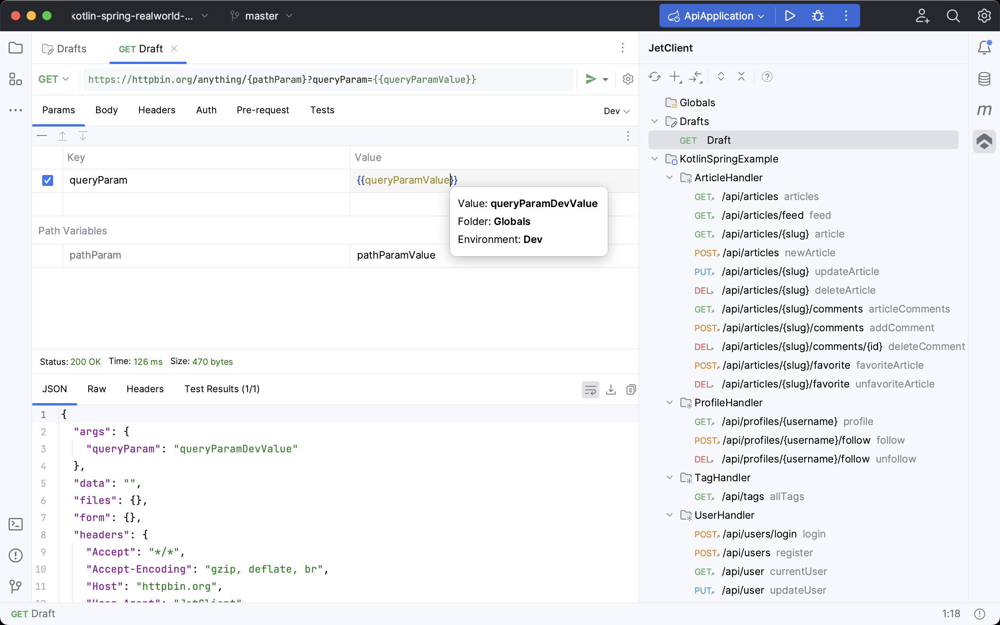

JetClient
===
[](https://plugins.jetbrains.com/plugin/21173-jetclient--the-ultimate-rest-client)
[](https://plugins.jetbrains.com/plugin/21173-jetclient--the-ultimate-rest-client)
[](https://plugins.jetbrains.com/plugin/21173-jetclient--the-ultimate-rest-client/reviews)

[JetClient](https://plugins.jetbrains.com/plugin/21173-jetclient--the-ultimate-rest-client) is a simple and powerful API
client plugin for JetBrains IDEs (IntelliJ IDEA, GoLand, PyCharm, PhpStorm, etc.).
It combines the best features of existing API clients with additional enhancements, all within your IDE.
Key features include:

- **File Sync (Git Sync)**: Stores requests and folders in a human-readable format on your file system, enabling easy
  sharing and collaboration with your team via Git.
- **Environment Groups**: Create environment groups to select multiple environments at once. For example, one group
  for (dev, test, prod) and another for (user, admin).
- **Convenient Variable Management**: Variables are defined in JSON5 format and organized into two editors: shared (
  synced) and local (non-synced). Variables can include not only primitive types but also objects and arrays.
- **Powerful Scripting**: Write pre-request and test scripts for requests and folders. Additionally, create test suite
  scripts that can reuse existing requests, eliminating the need to duplicate them.
- **Integration with Source Code and OpenAPI**: Import APIs directly from your source code, and effortlessly navigate
  between requests and the corresponding code, and vice versa.
- **GraphQL Support**: Integrates seamlessly with JetBrains' GraphQL plugin for syntax highlighting and code completion.



Watch the [JetClient plugin video](https://youtu.be/hLPhPuoYjCY) to learn about the plugin features.

## Contents

- [Project](#project)
- [File Sync (Git Sync)](#git-sync)
- [Environments](#environments)
- [Variables](#variables)
- [Scripts](#scripts)
- [Cookies](#cookies)
- [Proxy](#proxy)
- [Http/2](#http2)
- [Import](#import)
- [Contribution](#contribution)
- [Privacy](#privacy)

<a name="project"></a>

## Project

A **Project** is a root collection consisting of folders and requests. It includes its own settings, environments,
variables, and an init script. Projects in JetClient are independent of the IDE project, you can have multiple JetClient
projects within a single IDE project.

<a name="git-sync"></a>

## File Sync (Git Sync)

**File Sync (Git Sync)** enables saving and restoring your request collections on the local file system. This allows for
easy sharing of collections with your team via Git or any other version control system (VCS).

### How to Use File Sync

- **Enable Sync:** Turn on synchronization when creating a new JetClient project or in the project settings.
- **Set Sync Path:** Specify the directory path where the sync files will be stored.
- **Save or Restore:** Right-click on the project root or a specific request/folder, and choose `Save All` or `Save` to
  save. To restore or view diffs, select the corresponding options from the same context menu.

To exclude a specific folder from syncing, disable synchronization in its properties. This change will apply to all
nested folders as well.

<a name="environments"></a>

## Environments

**Environments** enable the use of different sets of variables for various contexts.
These are organized into **Environment Groups**, and you can select multiple environments simultaneously, one from each
group.

A `Default` environment group is always available, typically including environments like `Local`, `Staging`,
and `Production`.
You can also create your own environment groups, such as `User`, `Client`, `Region`, `API Version`, and others.

Environments are defined per project and can be created in the `Environments` tab.
Variables for these environments are set in the `Variables` tab.

<a name="variables"></a>

## Variables

Variables in JetClient can be defined at different levels: project, folder, and runtime.

- **Runtime Variables:** Defined in scripts and only available during script execution.
- **Project and Folder Variables:** Defined in the `Variables` tab of the project or folder, using
  the [JSON5 format](https://json5.org/).

The variables editor is divided into two sections: **Shared** and **Local**.

- **Shared Variables** are saved in the project/folder sync file and can be shared with your team.
- **Local Variables** are securely stored on your system and are not included in the sync file.

Project variables include environment-specific variables and `globals`, which are accessible regardless of the selected
environment. They are organized within a JSON object with the environment as a top-level property:

```json5
{
  globals: {
    baseUrl: 'https://api.example.com'
  },
  local: {
    token: 'localToken'
  },
  dev: {
    token: 'devToken'
  }
}
```

Folder variables are defined in a JSON object without an environment property:

```json5
{
  myFolderVar: 'myValue'
}
```

Variables in JetClient can be primitive types, objects, and arrays, and are usable in scripts, requests, and folders. To utilize a variable in any field, enclose it in double curly braces: `{{myVar}}`. You can reference entire objects or arrays, for example in the body of a request, using `{{myRequestBody}}`.

Variables can also reference other variables, as shown in the example below:

```json5
{
  array: [
    {
      myProperty: 123
    }
  ],
  // This variable resolves to string "123"
  myVar: '{{array[0].myProperty}}',
  // This variable resolves to number 123
  myVar2: {{array[0].myProperty}}
}
```

### Variable Resolution Order

Variables are resolved in the following order, from highest to lowest priority:

1. Runtime variables
2. Local folder variables
3. Shared folder variables
4. Variables from all parent folders (both local and shared)
5. Environment variables
6. Globals

<a name="scripts"></a>

## Scripts

Requests and folders in JetClient can have **Pre-request** and **Test** scripts written in JavaScript, while test suites
contain only **Test** scripts. The project includes an **Init Script** executed once per run, which can be used to
define global functions and variables. For example:

```js
CryptoJS = require("crypto-js");

hmacSHA256 = (message) => {
    return CryptoJS.HmacSHA256(message, jc.environment.get('secret')).toString();
}
```

You can then use `CryptoJS` and `hmacSHA256` in your pre-request and test scripts.

### Execution Order

Scripts are executed in the following order when you send a request or run a folder with the runner:

1. **Init script** of the project (executed once per run)
2. **Pre-request scripts** of all parent folders (from the root to the current folder)
3. **Pre-request script** of the request
4. **Test scripts** of all parent folders (from the root to the current folder)
5. **Test script** of the request

Steps 2-5 are repeated for each request in the run.

For test suites, scripts execute in this order:

1. **Init script** of the project
2. **Test script** of the test suite

Scripts from `jc.runRequest`, `jc.runFolder`, or `jc.runTestSuite` follow the same execution order as for requests,
folders, and test suites.

### Scripting Library

JetClient built-in library is similar to Postman's but instead of `pm` it is called `jc`.
For example,

```js
jc.test("Status code is 200", () => {
    jc.expect(jc.response.code).to.eql(200)
})
```

JetClient scripts can utilize the [Chai Assertion Library BDD](https://www.chaijs.com/api/bdd/).
For more details, see the [JetClient Library documentation](docs/jet-client-library.md).
Also, see [JetClient Library Types](docs/jet-client.d.ts) for type definitions.

### External Libraries

JetClient includes built-in libraries such
as `ajv`, `atob`, `btoa`, `chai`, `cheerio`, `crypto-js`, `csv-parse/lib/sync`, `lodash`,
`moment`, `tv4`, `uuid`, and `xml2js`, which you can import using the require function.
Additionally, you can add your own libraries to the scripts. Navigate to `Settings > Tools > JetClient` and set
the `Libraries directory`.
If you are using npm libraries, specify the directory containing your `package.json` and `node_modules`.
Otherwise, use the directory where your script libraries are located. You can then use require to import your libraries.

<a name="cookies"></a>

## Cookies

Manage cookies using the `Cookies Manager`. To open it, click on `Cookies Manager` in the toolbar of the tool window.

<a name="proxy"></a>

## Proxy

Proxies are supported using the [IDE Proxy Settings](https://www.jetbrains.com/help/idea/http-proxy.html).

<a name="http2"></a>

## HTTP/2

To send a request using the `HTTP/2` protocol, please select `HTTP/2` option
in `Settings > Tools > JetClient > HTTP Version`.

<a name="import"></a>

## Import

JetClient supports importing collections from various sources:

- JetClient Project
- Spring
- JAX-RS
- Retrofit
- OpenAPI (Swagger)
- cURL
- Postman

To import a cURL request, simply copy the cURL command and paste it into the URL field of a request.

<a name="contribution"></a>

## Contribution

- If you'd like to improve documentation, please submit a PR.
- Suggestions to further improve the product.

<a name="privacy"></a>

## Privacy

- **Offline Only:** JetClient is an offline-only plugin and does not collect any data.
- **Secure Storage:** Local variables, cookies, and OAuth2 tokens
  are [stored securely on your system](https://plugins.jetbrains.com/docs/intellij/persisting-sensitive-data.html). This
  includes using KeePass on Windows, Keychain on macOS, and libsecret on Linux.
- **No Cloud Sync:** There is no backend or cloud synchronization. Sensitive data is securely stored on your system.
  Other data is saved in the `.idea/JetClient` directory of your project and in JetClient sync files if synchronization
  is enabled.

